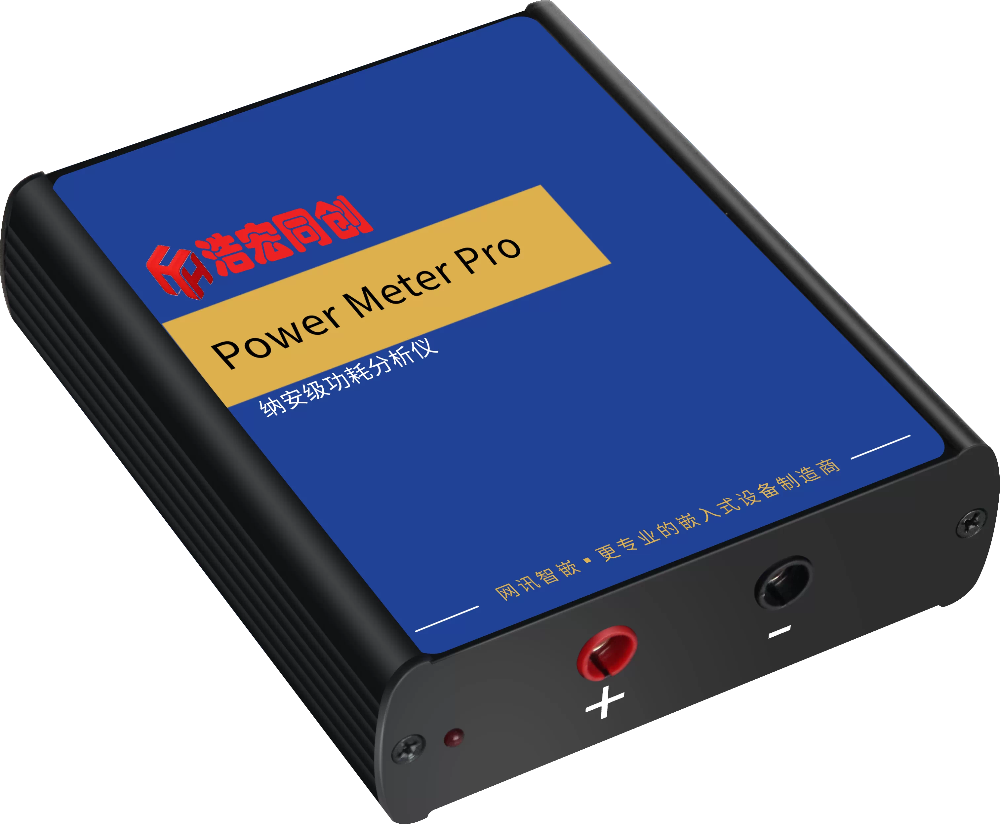
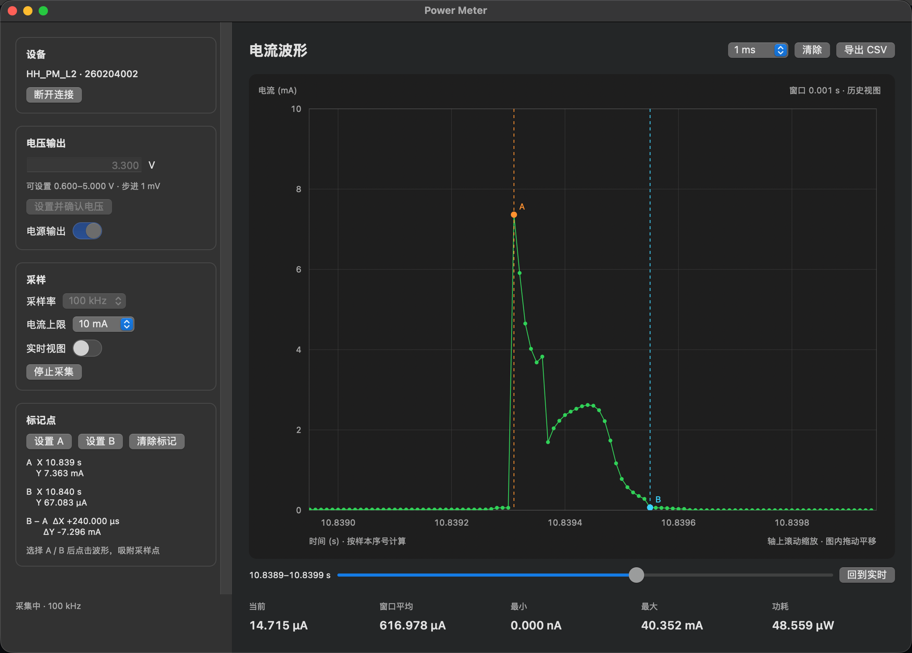

# PowerMeterMac

非官方的 macOS 原生 POWER Meter Pro 控制与电流分析工具。它通过逆向工程得到的 USB 协议连接 `VID 0811 / PID f122`，不依赖 Windows DLL。

> [!CAUTION]
> **这是第三方非官方项目，与设备制造商无隶属、授权或担保关系。** 本软件通过逆向工程开发，能够设置并开启硬件电压输出。协议差异、固件变化、接线错误或软件缺陷可能损坏仪器及被测设备。请先在限流和保护条件下验证；谨慎使用，使用风险及产生的后果由使用者自行承担。

## 设备与应用

<p align="center">
  
</p>

<p align="center"><em>POWER Meter Pro 设备</em></p>

<p align="center">
  
</p>

<p align="center"><em>PowerMeterMac 波形、采样点与 A/B 标记界面</em></p>

## 功能边界

- 自动连接单台设备并显示型号、序列号、硬件与固件版本
- 0.600–5.000 V 输出设置，1 mV 步进
- 输出开启/关闭；连接采用两阶段关断，断开和退出时再次关闭输出
- 10/20/50/100 kHz 电流采样、实时/冻结波形、当前/平均/最小/最大/功耗统计
- CSV 原始数据导出
- 明确的时间与电流刻度；X 轴区域滚动只缩放时间，Y 轴区域滚动只缩放电流，其他位置滚动无响应；图内拖动、方向键或滑块平移历史
- 支持并验证当前连接设备 `HH_PM_L2 / HW V1.0.0 / FW V1.0.3`

硬件以 100 kHz 输出原始样本，较低采样率按官方 Windows SDK 的算法降采样。应用不提供脚本控制、超过设备描述符或 5 V 的输出、修改校准、固件升级或多设备同时采集。

## 构建与运行

需要 macOS 14+、Swift 5.10+ 和 Homebrew `libusb`：

```sh
brew install libusb
swift run PowerMeterMac
```

生成可双击运行、内含 USB 运行库的应用：`zsh scripts/build-app.sh`。产物位于 `dist/Power Meter.app`。

GitHub Actions 会在每次推送到 `main`、Pull Request 或手动触发时运行自测并构建应用。构建完成后可在对应 Actions 运行页面下载 `Power-Meter-macOS-*` 工件，其中包含可执行的 `Power Meter.app`。

当 GitHub Release 正式发布时，发布工作流会检出该 Release 的标签，重新测试并构建应用，生成 `Power-Meter-macOS-*.dmg` 和对应的 SHA-256 文件，并自动附加到 Release。当前应用使用临时签名，尚未进行 Apple Developer ID 签名和公证。

只做安全诊断（电源输出始终关闭）：

```sh
swift run powermeter list
swift run powermeter info
swift run powermeter sample 1 100
```

运行不依赖硬件的协议与安全测试：`swift run PowerMeterSelfTest`。

波形默认显示 10 秒，纵轴通过“电流上限”手动选择，不会随数据自动缩放。在 X 轴刻度区滚动按鼠标时间位置缩放，在 Y 轴刻度区滚动调整电流上限；绘图区、标题区及两轴交角的滚动被忽略。图内拖动会冻结历史视图，点击“回到实时”恢复跟随。后台保留最近 600 万个样本（100 kHz 下为 60 秒），冻结视图保留独立快照。每次重新开始采集重置波形时间和数据，请先导出需要保存的上一轮数据。

“窗口平均”只计算当前显示时间区间内真实样本的算术平均值，空白区域不计入，随平移和时间档位立即更新；无样本时显示“—”。最小/最大仍为整轮采集统计。

左栏点击“设置 A”或“设置 B”后，在波形中点击所需时间位置，自动吸附到最近的可见真实采样点，并冻结视图。显示 X、Y 及 B−A 的 ΔX、ΔY，时间和电流会自动选择 `ns/µs/ms/s` 与 `nA/µA/mA/A`。可重复设置，清除数据或新一轮采集会清除标记。侧栏可滚动。

曲线仅用真实采样点按时间顺序直线连接，不做平滑或插值。高密度数据选取分组首尾点及极值点，保留其原始时间、电流；放大到相邻样本约 6 px 时显示每个采样点，A/B 始终保留为折线顶点。CSV 与窗口平均仍使用完整样本。

官方 Windows SDK、产品说明书和设备固件未包含在本仓库中。`Vendor/libusb/libusb.h` 来自 libusb，并保留其 LGPL-2.1-or-later 版权声明。

连接安全顺序为：USB 复位稳定后尝试关断、读取最小身份信息、再次关断并要求成功应答，最后读取校准数据。关断未确认时不会进入可操作状态。输出开启时禁止修改电压；任何电压设置结果不确定都会清除本次电压确认。每条控制命令在发送前和收到结果后同步记录到 `~/Library/Logs/PowerMeterMac/commands.jsonl`。输出开启失败或结果未知时会立即发送一次底层紧急关断。
